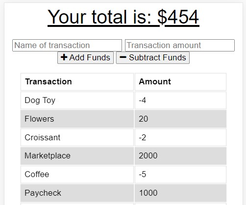

 

# 
 **Budget Tracker** 

---

## **Table Of Contents** 

---

1. [Description](#description)
2. [Installation](#installation)
3. [Usage](#usage)
4. [Deployment](#github)
5. [Contact](#contact)

--- 

## 
 **Description** 
 

--- 

This app allows users to add expenses and deposits to their budget with or without a connection. When entering transactions offline, they will populate the total when brought back online.

--- 
 
## 
 **Installation** 

--- 
 

<li>If you would like to download it locally, clone the repo and run `npm i`.  This will install all dependencies</li>
<li>Initialize the app in the command line with `npm start` </li>
<li>In the command line note which port the server is being run on and input `localhost:{givenPORT}` in the browser</li>
</ol>

--- 

## 
 **Usage** 

--- 
<ol>
<li>Take advantage of this app to meet your financial goals!</li>
<li>The app begins by showing previous transactions.</li>
<li>Transactions can be added or subtracted from the toal. </li>
<li>Transactions will be saved as pending in IndexedDB when offline and populate when internet access is restored. </li>
</ol>

---

## 
 **Deployment** 

---

<ul>
   <li>

### _Github:_ https://github.com/markkimeyer/budget-tracker
</li>
<li>

### _Heroku:_ https://mmbudget-tracker.herokuapp.com/
</li>
<li>

### _YouTube Demo:_ https://youtu.be/lyvq1NsCcZY/
</li>
</ul>

---
## 
 **Contact** 

---

 Email: markkimeyer@gmail.com 

